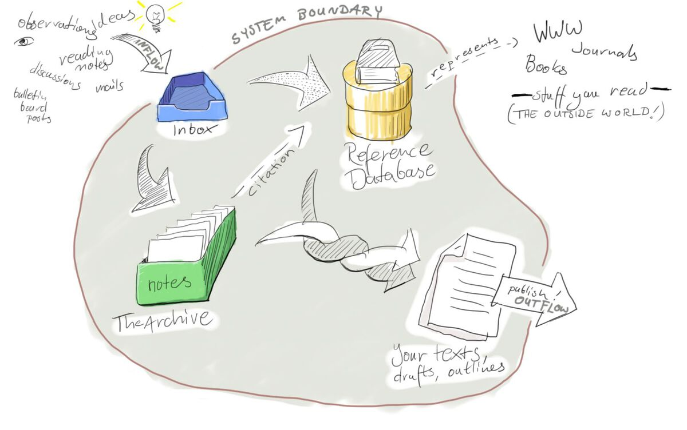

# Building blocks of a Zettelkasten

**The building blocks of a Zettelkasten** are three related parts; inbox, archive and reference database:

1. Inbox: the gateway into your knowledge system
2. Archive: the one, trusted place to look for information
3. Reference Database: interface to the outside world

  
As a system, that looks like: 

The inbox, then, is similar to a GTD inbox, but for your non-actionable info: 

* Observations
* Ideas 
* Reading notes
* Discussions
* Emails 

The notes archive is a personal information database—essentially a filing cabinet \(digital or otherwise\) of your permanent notes \(Zettels\).

The reference database contains all the links to the external sources used within the inbox and archive.  

The reference database doesn't have to be a physical database, just a representation of real world information sources you can keep within your system. 

This way of structuring a Zettelkasten fits well with the idea of there being four kinds of notes \(fleeting, permanent, literature and project\) as described by Sonke Ahrens in How to Take Smart Notes. 

The inbox is the place for fleeting notes whereas the notes archive is where permanent and literature notes are stored. What isn't clearly defined is where project notes are stored. 

Project notes straddle a line between fleeting and permanent \(in that they're permanent only as long as their related project is in progress\) so could have their own section. Alternatively, they could exist outside the Zettelkasten entirely in "outflow" section of the diagram. 

**RELATED:**







**SOURCE:**

\*\*\*\*[**Building Blocks of a Zettelkasten**](https://zettelkasten.de/posts/zettelkasten-building-blocks/)\*\*\*\*

