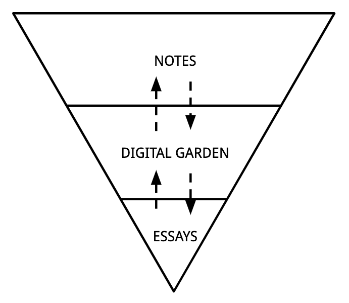

# Digital gardens

Digital gardens sit in the space between your private notes and your polished creative work. They're a place to plant and grow ideas, and [work with the garage door up](working-with-the-garage-door-up.md) by building a public space to share your digital content. 

The idea is to take your personal notes and share them publicly in a linked interface \(similar to Niklas Luhman's [Zettelkasten method](the-zettelkasten-method.md)\) so readers can follow your thoughts across different topics, ideas and concepts.  

By making your thoughts shareable, you reap the benefits of [creative compounding](creative-compounding.md) and are also able to contribute to the growth of our collective online intelligence. 

_Some of my favourite examples of digital gardens:_ 

* \*\*\*\*[**Andy Matuschak's working notes**](https://notes.andymatuschak.org/About_these_notes)\*\*\*\*
* \*\*\*\*[**Tom Critchlow's experiments in hypertext thinking**](https://tomcritchlow.com/wiki/)\*\*\*\*
* \*\*\*\*[**Rosie Campbell's notes**](https://rosiecampbell.me/notes)\*\*\*\*
* \*\*\*\*[**Salman Ansari's shared notes**](https://notes.salman.io/)\*\*\*\*
* \*\*\*\*[**Nikita Voloboev's personal wiki**](https://wiki.nikitavoloboev.xyz/)\*\*\*\*

### **References:** 

> A mind garden is not a mind backyard. It’s not about dumping notes in there and forgetting about them. To tend to your garden, you need to plant new ideas. The best way to do this is by replanting stems and cuttings from existing ideas you’ve added to your garden—by consistently taking notes, and combining them together, a bit like grafting \(Conor White-Sullivan, the founder of Roam, calls this [idea sex](https://nesslabs.com/conor-white-sullivan-interview)\). Sometimes, two seemingly remote or even incompatible ideas will give birth to a new insight. \(look at the pomato, a weird hybrid of tomato and potato\)
>
> **Source:** [https://nesslabs.com/mind-garden](https://nesslabs.com/mind-garden)

### **Related notes:** 









